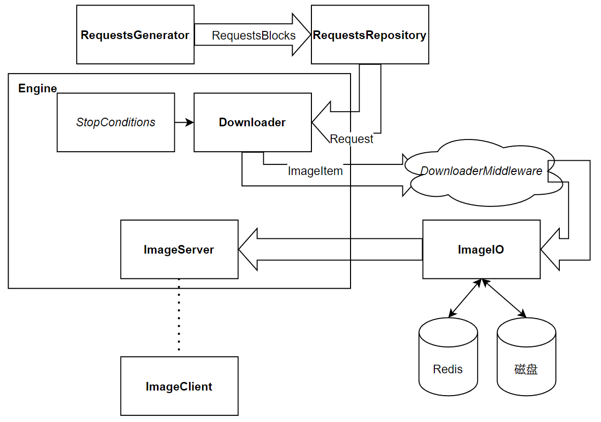

### 这是一个基于requests库的轻量级多线程~~二刺螈~~图片爬虫框架

---

<div align="center">
  <a href="docs/二刺螈README.md"> 二次元版本的文档(还在施工) </a>
</div>

## 说明

一般而言，当大量爬取图片的时候，我们都会经过两步：

- 先通过某个请求获取到一批图像的原始链接
- 然后逐个解析出这些链接并下载原始图像

相对而言，第一步是与网站页面强相关的，提取页面信息的方法随着网页布局的变化而改变；但第二步往往是只需要简单地发送第一步构造出来的请求然后接收数据即可。

**因此，基于上述原则，其实就可以构建出一个图像下载框架了————用户负责编写提取页面信息的逻辑，下载工作由框架完成，再顺便往里面填充一些别的功能。**

另外，我还希望这个爬虫框架能够在一些arm-linux设备上运行(这也是我的需求)，而这些设备一般都是些电视盒子刷固件或者是广告机拆机之类的，其性能差，同时很多软件包装不上或者是很麻烦。所以我也希望这个爬虫框架依赖足够少、运行时占用也能够尽量小但依然能够保持高效的下载速度。

除此之外，由于其运行在arm设备上，我不会一直监控它，所以也希望它能实现爬取一定数量或一定时间后自动停止，同时能实现在每天某个时间段自动开启或停止。当然，如果它能提供web交互选图功能就更好了。

所以最终的目标是实现一个**基于requests库、能够多线程下载、依赖少、定义爬取足够简单、配置灵活、能够定时启停并且有每次运行的停止条件、集成redis数据库、有客户端**的图像爬取框架。~~感觉主要还是针对二次元图片进行下载~~

## 运行demo(简单的使用说明)

- 首先，先将此仓库的main分支下载到本地

```
git clone https://github.com/ppxxxg22/anime_crawler.git
```

- 在目录下有一个`demo.py`文件，里面给出了运行此框架的基本步骤

```python

# 导入engine和stopconditions
from anime_crawler import StopConditions, Engine
# 导入自带的RequestsGenerator
from anime_crawler import RequestsGenerator

# 实例化一个停止条件
a = StopConditions()
# 添加停止条件，这里是爪巴取10分钟后停止
a.add_stop_condition(lastingtime=10)
# 开始爪巴
Engine.run(RequestsGenerator, a)

```

> 简单概括就是:
> 
> 1. 给出能够生成需要爬取的图像的`Request`请求的类(需要依据自定义爬取网站而定)
> 
> 2. 定义爬虫停止条件(框架自带，只需要填写参数)
> 
> 3. 运行
>
> 是不是很简单呢

其中源文件中提供了一个爬取并下载`https://api.lolicon.app/#/setu`中图片的`RequestsGenerator`类，假如你不是爬这个网站，那么你需要自定义`RequestsGenerator`类，当然也是很简单的，只需要让他每次生成一些`Request`请求就可以了。

关于爬虫的配置项可以在`anime_crawler/settings.py`中进行设置，主要配置有并发数目、下载地址、是否启用Redis等等，可以根据自己需求配置。

另外，本框架中基本上所有的类都支持自定义更换，只需要在`Engine.run`时传入对应需要更换的模块即可，这部分可以参阅后面。

## 自定义爬取对象(高级的使用说明)

- 在目录下有一个`demo_advanced.py`文件，里面给出了关于自定义爬取对象的部分(下面截取主要部分用于简述)

```python

from anime_crawler import RequestsGenerator, StopConditions, Engine
from requests import Request


# 需要继承自RequestsGenerator并重写usr_generator函数即可
class myGnerator(RequestsGenerator):
    def __init__(self) -> None:
        super().__init__()

    def usr_generator(self) -> Request:
        '''
        这是一个生成器，用于生成Request对象
        '''

        # 这里放你的爬取逻辑，每次yield一个Request对象
        yield Request("get", "https://www.baidu.com")

    def generator_middleware(self) -> Request:
        '''
        这是中间键，用于预处理Request对象，比如添加headers，cookies等
        如果你不需要这个功能，可以不修改这个函数
        这个函数默认的功能是什么都不做，像下面这样
        '''
        yield from self.usr_generator()


if __name__ == "__main__":
    # 运行方法和之前一致
    a = StopConditions()
    a.add_stop_condition(lastingtime=10)
    Engine.run(myGnerator, a)

```

想要爬取一个网站，只需要定义自己的请求生成类，需要继承自`anime_crawler.RequestsGenerator`，然后重写`usr_generator`函数，并在这个函数中定义自己的爬取逻辑即可。**详细的还是看一下`demo_advanced.py`哦**。

另外一个函数是`generator_middleware`，可以看成是中间键，可以用于对Request对象添加headers，cookies等，默认这个函数什么也不做。

定义完成自己的爬取逻辑后，还是像之前一样运行爬虫。

## 架构信息

**如果你感兴趣可以看一下本框架架构**

架构图如下



下面来对这些模块做一些说明

- `RequestsGenerator`: 这个就是用户自定义爬取内容时需要修改的东西，每次调用会生成由多个`Request`请求组成的`RequestsBlock`。源文件中提供了一个爬取并下载`https://api.lolicon.app/#/setu`中图片的默认配置。

- `RequestsRepository`: 存储`Request`的仓库，内置`BloomFilter`。当剩余可用`Request`请求不多的时候会调用`RequestsGenerator`生成一批`Request`请求。

- `Downloader`: 多线程图像下载器，使用线程池进行管理管理，每次从`RequestsRepository`中pop一个`Request`请求并进行下载，完成后会调用`ImageIO`将图像进行存储。

- `StopConditions`: 下载器停止条件，负责监测当前次下载器是否到达停止条件，也会在到达启动条件时启动下载器。目前支持：当前次下载数限制、当前次下载大小限制、当前次持续时间限制和每天固定时间段启停运行条件。

- `ImageIO`: 负责将二进制格式的图片组织成`ImageItem`类，并与文件或Redis数据库进行交互。

- `Engine`: 负责整个框架的运行调度，包括为`Downloader`添加请求、检测是否到达停止条件等。

- `ImageServer`和`ImageClient`: 用户可以通过`ImageClient`来查看下载结果，目前这两个模块只存在于概念中。

